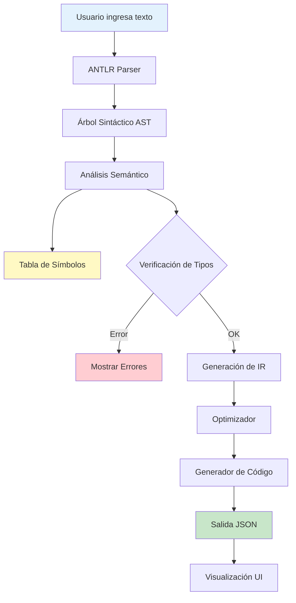
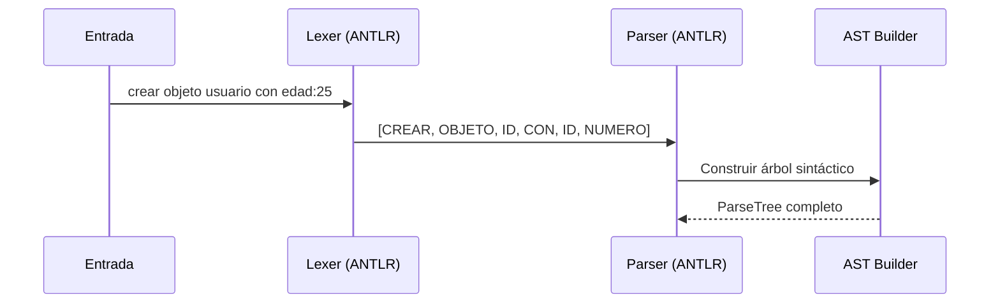
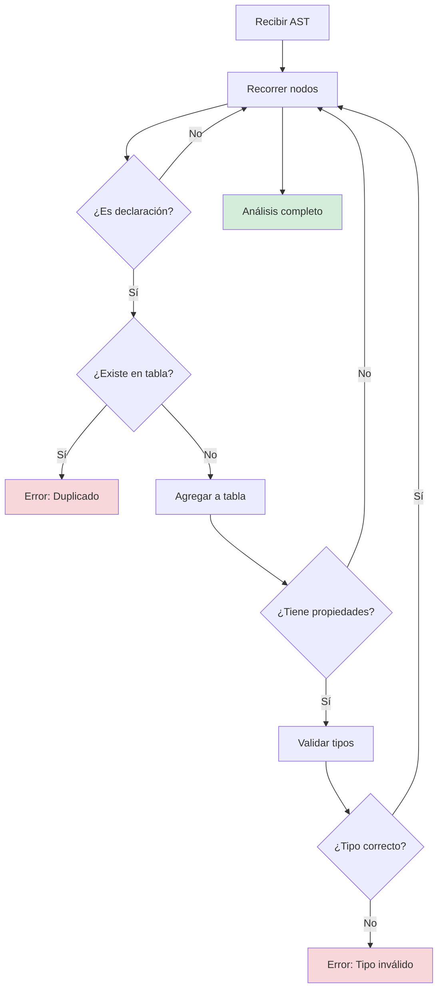
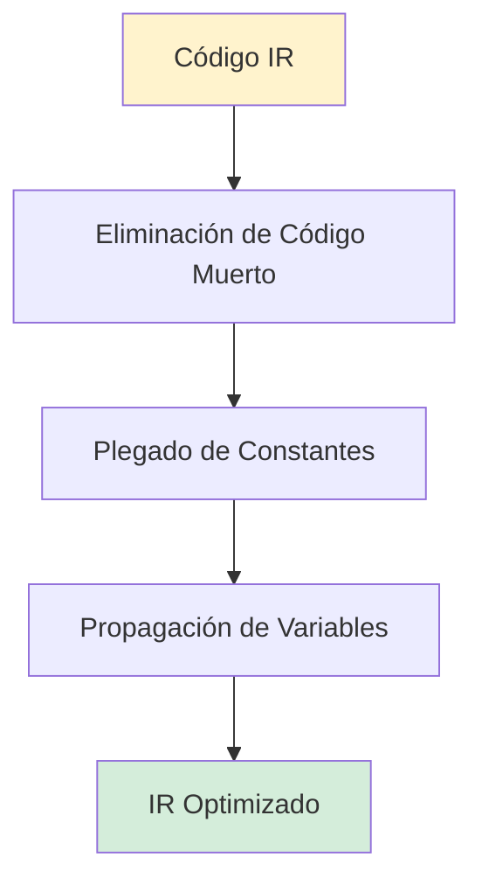
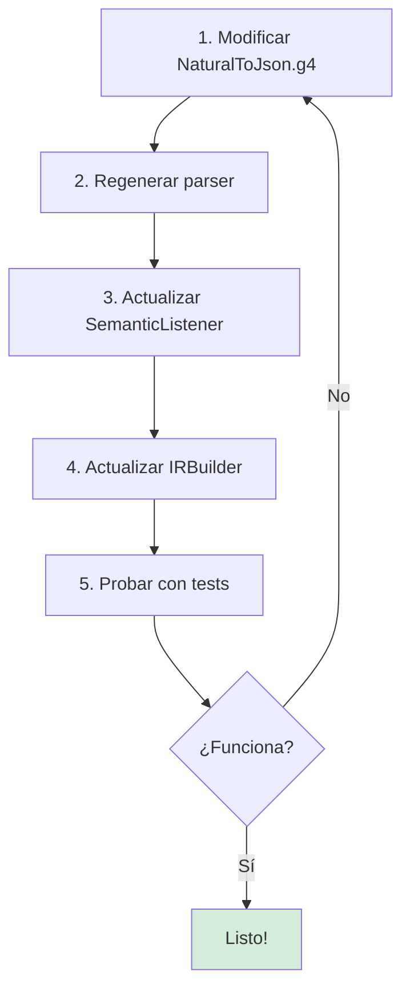

# Manual Técnico - Natural to JSON Compiler

> [!NOTE]
> Este manual detalla la arquitectura interna del compilador y está dirigido a desarrolladores que deseen comprender o extender el sistema.

🚀 **[Ver Demo en Vivo](https://natural-to-json-compiler-web.vercel.app/)**

## 📋 Tabla de Contenidos

- [Visión General](#visión-general)
- [Arquitectura del Sistema](#arquitectura-del-sistema)
- [Fases del Compilador](#fases-del-compilador)
- [Estructura de Archivos](#estructura-de-archivos)
- [Guía de Extensión](#guía-de-extensión)

---

## Visión General

El **Natural to JSON Compiler** es un compilador completo que traduce descripciones en lenguaje natural (español) a formato JSON estructurado. Implementa todas las fases clásicas de un compilador:


---

## Arquitectura del Sistema

### Stack Tecnológico

| Componente | Tecnología | Propósito |
|------------|------------|-----------|
| **Frontend** | Next.js (React) | Interfaz web interactiva |
| **Lenguaje** | TypeScript | Lógica del compilador |
| **Análisis** | ANTLR4 | Generación de parser |
| **Testing** | Vitest | Pruebas unitarias |

### Flujo de Datos Completo



---

## Fases del Compilador

### 1️⃣ Análisis Léxico y Sintáctico

> [!IMPORTANT]
> Utiliza ANTLR4 para generar automáticamente el lexer y parser desde la gramática.

**Archivos:**

- Gramática: [NaturalToJson.g4](../../src/NaturalToJson.g4)
- Parser generado: `src/generated/`

**Proceso:**



**Tokens principales:**

- `CREAR`, `OBJETO`, `CON`
- `ID` (identificadores)
- `STRING`, `NUMBER`, `BOOLEAN`

---

### 2️⃣ Análisis Semántico

> [!WARNING]
> Esta fase detecta errores que el análisis sintáctico no puede capturar (tipos, duplicados, etc.)

**Archivos:**

- [analyzer.ts](../../src/lib/analyzer.ts)
- [SemanticListener.ts](../../src/lib/SemanticListener.ts)
- [SymbolTable.ts](../../src/lib/SymbolTable.ts)

**Validaciones realizadas:**

| Validación | Descripción | Ejemplo de Error |
|------------|-------------|------------------|
| **Duplicados** | Verifica que no se declaren nombres duplicados | `crear objeto user` (x2) |
| **Tipos** | Valida tipos de propiedades especiales | `edad:"texto"` ❌ |
| **Palabras Reservadas** | Evita uso de keywords como IDs | `crear objeto crear` ❌ |

**Diagrama de Flujo:**



---

### 3️⃣ Código Intermedio (IR)

**Archivos:**

- [IRBuilderListener.ts](../../src/lib/IRBuilderListener.ts)
- [irTypes.ts](../../src/lib/irTypes.ts)

**Formato de Instrucciones:**

```typescript
interface IRInstruction {
  op: 'CREATE_OBJ' | 'ASSIGN_PROP'
  target: string
  args: any[]
}
```

**Ejemplo de traducción:**

```
Entrada: crear objeto usuario con nombre:"Juan"

IR generado:
[
  { op: 'CREATE_OBJ', target: 'usuario', args: [] },
  { op: 'ASSIGN_PROP', target: 'usuario.nombre', args: ['Juan'] }
]
```

---

### 4️⃣ Optimización

**Archivos:**

- [optimizer.ts](../../src/lib/optimizer.ts)

**Técnicas implementadas:**



**Ejemplo:**

| Antes (IR) | Después (Optimizado) |
|------------|----------------------|
| `temp1 = 5 + 3`<br>`x = temp1` | `x = 8` |
| `y = x * 1` | `y = x` |

---

### 5️⃣ Generación de Código Final

**Archivos:**

- [codegen.ts](../../src/lib/codegen.ts)
- [JsonBuilderListener.ts](../../src/lib/JsonBuilderListener.ts)

**Proceso:**


---

## Estructura de Archivos

```
src/
├── NaturalToJson.g4          # Gramática ANTLR
├── generated/                # Archivos generados por ANTLR
├── lib/
│   ├── analyzer.ts          # Orquestador principal
│   ├── SemanticListener.ts  # Validaciones semánticas
│   ├── SymbolTable.ts       # Tabla de símbolos
│   ├── IRBuilderListener.ts # Generador de IR
│   ├── irTypes.ts           # Tipos de IR
│   ├── optimizer.ts         # Optimizador
│   ├── codegen.ts           # Generador JSON
│   ├── JsonBuilderListener.ts
│   └── valueUtils.ts        # Utilidades
├── components/              # UI Components
└── app/                     # Next.js pages
```

---

## Guía de Extensión

### Agregar Nueva Sintaxis

> [!CAUTION]
> Modificar la gramática requiere regenerar todos los archivos de ANTLR.

**Pasos:**



**Ejemplo: Agregar arrays**

1. **Gramática** (`NaturalToJson.g4`):

```antlr
arrayDecl: 'crear' 'lista' ID 'con' '[' valueList ']';
```

2. **Semántica** (`SemanticListener.ts`):

```typescript
exitArrayDecl(ctx) {
  this.symbolTable.add(ctx.ID().getText(), 'ARRAY');
}
```

3. **IR** (`IRBuilderListener.ts`):

```typescript
exitArrayDecl(ctx) {
  this.emit({ op: 'CREATE_ARRAY', target: ctx.ID() });
}
```

---

## Troubleshooting

| Problema | Causa Probable | Solución |
|----------|----------------|----------|
| Parser no reconoce sintaxis | Gramática desactualizada | Verificar `NaturalToJson.g4` |
| Errores de tipo inconsistentes | Tabla de símbolos corrupta | Reiniciar análisis |
| IR incompleto | Listener no registrado | Verificar `IRBuilderListener` |

---

## Referencias

- [ANTLR Documentation](https://www.antlr.org/)
- [Next.js Docs](https://nextjs.org/docs)
- Código fuente: `src/lib/`

---

## 🤖 Asistencia Técnica con IA

¿Necesitas ayuda para entender la arquitectura, extender la gramática o depurar el compilador?

Puedes consultar a nuestra IA técnica, que tiene acceso completo al código fuente y documentación del proyecto.

👉 **[Consultar a la IA del Proyecto](https://deepwiki.com/CarlosVerasteguii/natural-to-json-compiler-web)**

La IA (Devian) puede ayudarte a:
- Explicar el flujo de datos entre componentes.
- Generar snippets para nuevos Listeners.
- Analizar errores de compilación o runtime.

