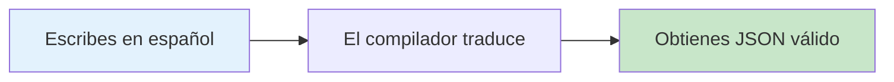
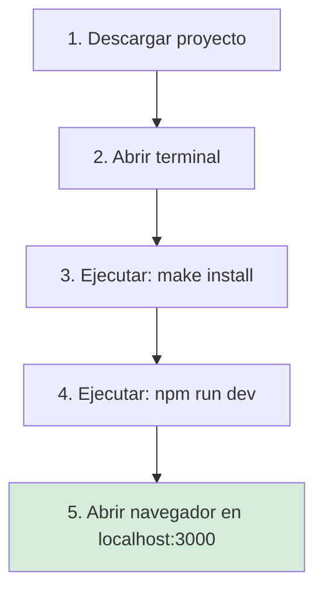
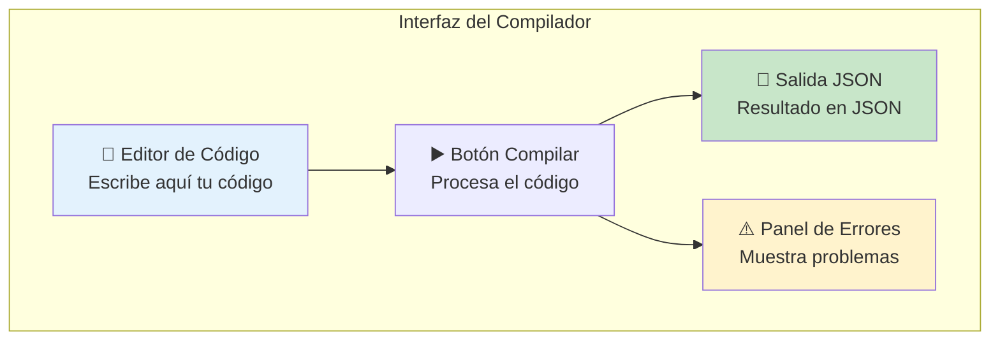
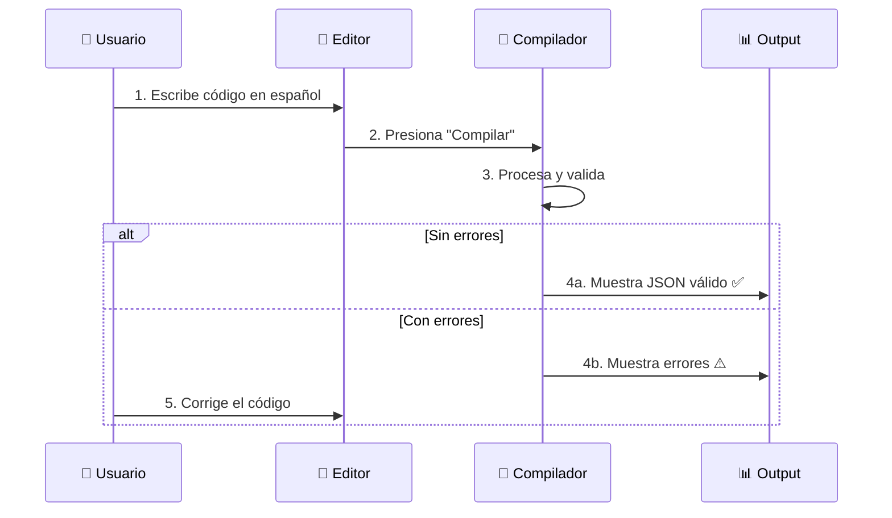
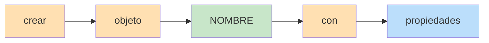
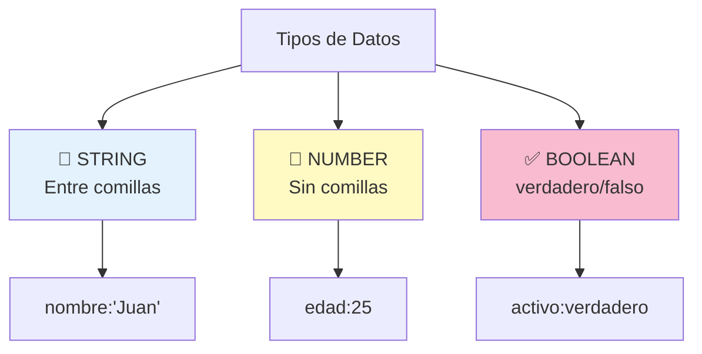
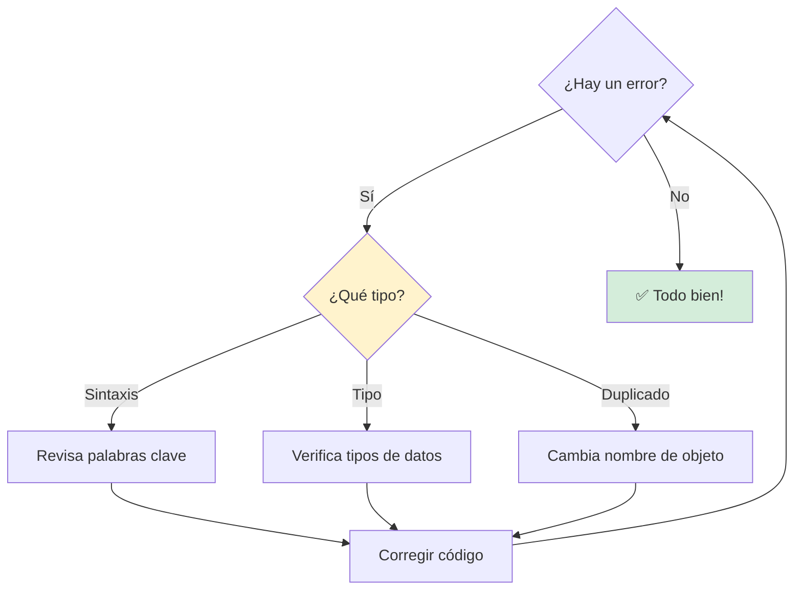

# Manual de Usuario - Natural to JSON Compiler

> [!NOTE]
> Este manual está dirigido a usuarios que desean aprender a utilizar el compilador para convertir descripciones en lenguaje natural a formato JSON.

## 📋 Tabla de Contenidos

- [¿Qué es esto?](#qué-es-esto)
- [Instalación Rápida](#instalación-rápida)
- [Guía Visual de Uso](#guía-visual-de-uso)
- [Sintaxis del Lenguaje](#sintaxis-del-lenguaje)
- [Ejemplos Prácticos](#ejemplos-prácticos)
- [Solución de Problemas](#solución-de-problemas)

---

## ¿Qué es esto?

El **Natural to JSON Compiler Studio** es una herramienta web interactiva que te permite escribir descripciones simples en español y convertirlas automáticamente a formato JSON.

🚀 **[Probar Demo en Vivo](https://natural-to-json-compiler-web.vercel.app/)**

### ¿Para qué sirve?



**Ejemplo rápido:**

| Tu escribes... | Obtienes... |
|----------------|-------------|
| `crear objeto usuario con nombre:"Ana"` | `{"usuario": {"nombre": "Ana"}}` |

---

## Instalación Rápida

### Requisitos Previos

- **Node.js** v18 o superior ([Descargar aquí](https://nodejs.org/))
- Terminal de comandos

### Pasos de Instalación



**Comandos detallados:**

```bash
# Opción 1: Con Make (recomendado)
make install
npm run dev

# Opción 2: Sin Make
npm install
npm run dev
```

> [!TIP]
> Si ves el mensaje "Ready on <http://localhost:3000>", ¡todo está listo! 🎉

---

## Guía Visual de Uso

### Interfaz Principal



### Flujo de Trabajo Típico



### Paso a Paso

#### 1️⃣ Escribir Código

En el editor izquierdo, escribe tu descripción:

```text
crear objeto persona con nombre:"Juan", edad:30
```

#### 2️⃣ Compilar

Haz clic en el botón **"Compilar"** o presiona `Ctrl+Enter`.

#### 3️⃣ Ver Resultado

El JSON aparecerá en el panel derecho:

```json
{
  "persona": {
    "nombre": "Juan",
    "edad": 30
  }
}
```

---

## Sintaxis del Lenguaje

### Estructura Básica



### Palabras Clave

| Palabra | Uso | Ejemplo |
|---------|-----|---------|
| `crear` | Inicio de declaración | `crear objeto...` |
| `objeto` | Define un objeto | `...objeto usuario...` |
| `con` | Introduce propiedades | `...con nombre:"Ana"` |

### Tipos de Datos



### Reglas Importantes

> [!IMPORTANT]
> **Propiedades especiales con tipo fijo:**

| Propiedad | Tipo Requerido | ✅ Correcto | ❌ Incorrecto |
|-----------|----------------|-------------|---------------|
| `edad` | NUMBER | `edad:25` | `edad:"25"` |
| `activo` | BOOLEAN | `activo:verdadero` | `activo:"si"` |
| `nombre` | STRING | `nombre:"Ana"` | `nombre:Ana` |

---

## Ejemplos Prácticos

### Ejemplo 1: Objeto Simple

**Entrada:**

```text
crear objeto producto con titulo:"Laptop", precio:1200
```

**Salida:**

```json
{
  "producto": {
    "titulo": "Laptop",
    "precio": 1200
  }
}
```

---

### Ejemplo 2: Múltiples Objetos

**Entrada:**

```text
crear objeto usuario con nombre:"María", edad:28
crear objeto configuracion con tema:"claro", activo:verdadero
```

**Salida:**

```json
{
  "usuario": {
    "nombre": "María",
    "edad": 28
  },
  "configuracion": {
    "tema": "claro",
    "activo": true
  }
}
```

---

### Ejemplo 3: Propiedades Mixtas

**Entrada:**

```text
crear objeto empleado con nombre:"Carlos", edad:35, activo:verdadero, salario:5000
```

**Salida:**

```json
{
  "empleado": {
    "nombre": "Carlos",
    "edad": 35,
    "activo": true,
    "salario": 5000
  }
}
```

---

## Solución de Problemas

### Diagrama de Diagnóstico



### Errores Comunes

#### ❌ Error: "Palabra reservada"

**Problema:**

```text
crear objeto crear con id:1
```

**Causa:** `crear` es una palabra reservada.

**Solución:**

```text
crear objeto registro con id:1
```

---

#### ❌ Error: "Tipo incorrecto para 'edad'"

**Problema:**

```text
crear objeto persona con edad:"veinticinco"
```

**Causa:** `edad` debe ser un número.

**Solución:**

```text
crear objeto persona con edad:25
```

---

#### ❌ Error: "Objeto ya declarado"

**Problema:**

```text
crear objeto usuario con nombre:"Ana"
crear objeto usuario con nombre:"Pedro"
```

**Causa:** No puedes declarar el mismo nombre dos veces.

**Solución:**

```text
crear objeto usuario1 con nombre:"Ana"
crear objeto usuario2 con nombre:"Pedro"
```

---

### Tabla de Referencia Rápida

| Síntoma | Causa Probable | Solución |
|---------|----------------|----------|
| El servidor no inicia | Puerto 3000 ocupado | Cambiar puerto o liberar el 3000 |
| No aparece JSON | Error de sintaxis | Revisar panel de errores |
| JSON incorrecto | Tipos mal asignados | Verificar tipos de propiedades especiales |
| "Syntax Error" | Falta palabra clave | Revisar sintaxis básica |

---

## Preguntas Frecuentes

**Q: ¿Puedo usar mayúsculas en nombres?**  
A: Sí, los nombres son case-sensitive: `Usuario` ≠ `usuario`.

**Q: ¿Cuántos objetos puedo crear?**  
A: No hay límite, pero cada uno debe tener un nombre único.

**Q: ¿Funciona sin internet?**  
A: Sí, una vez instalado funciona completamente offline.

---

## Recursos Adicionales

- 📖 [Manual Técnico](Manual_Tecnico.md) - Para desarrolladores
- 📁 [Ejemplos válidos](../../examples/valid)
- 📁 [Ejemplos con errores](../../examples/invalid)

### Soporte

¿Tienes preguntas?

📧 Email: a2203330170@alumnos.uat.edu.mx | a2203330125@alumnos.uat.edu.mx

---

> [!TIP]
> **Pro Tip:** Usa `Ctrl+Enter` para compilar rápidamente sin usar el mouse. ⚡

---

## 🤖 Asistencia con IA

¿Tienes dudas sobre cómo usar el compilador o quieres entender mejor cómo funciona?

Puedes hacer preguntas directamente a nuestra IA entrenada con todo el código y documentación de este proyecto.

👉 **[Preguntar a la IA del Proyecto](https://deepwiki.com/CarlosVerasteguii/natural-to-json-compiler-web)**

La IA (Devian) tiene acceso a todo el repositorio indexado y puede ayudarte a:
- Entender errores específicos.
- Generar ejemplos de código.
- Explicar partes de la documentación.

