# Reporte de Evidencias - Compilador Natural to JSON

## Información del Proyecto

**Materia:** Compiladores 2  
**Institución:** Universidad Autónoma de Tamaulipas  
**Semestre:** Noveno semestre  
**Profesor:** Dr. Dante Adolfo Muñoz Quintero  

**Equipo de Desarrollo:**
- Carlos Verastegui Cruz
- Roberto Chavez Lopez

---

## Resumen Ejecutivo

El presente documento evidencia el desarrollo e implementación de un **compilador completo de lenguaje natural a formato JSON**, diseñado como proyecto integrador de la materia de Compiladores 2. Este sistema representa la culminación de los conocimientos adquiridos sobre teoría de compiladores, análisis léxico-sintáctico, análisis semántico, generación de código intermedio y optimización.

El proyecto implementa una solución innovadora que permite a los usuarios escribir definiciones de estructuras de datos utilizando comandos en **español**, facilitando la generación automática de JSON válido mediante un proceso de compilación robusto que incluye todas las fases tradicionales de un compilador profesional.

### Objetivos del Proyecto

1. **Diseñar e implementar** un compilador funcional que transforme descripciones en lenguaje natural (español) a formato JSON estructurado.
2. **Desarrollar una interfaz web interactiva** que permita visualizar en tiempo real el proceso de compilación.
3. **Implementar las cinco fases clásicas** de un compilador: análisis léxico, análisis sintáctico, análisis semántico, generación de código intermedio y generación de código final.
4. **Proporcionar herramientas de depuración** mediante la visualización del pipeline de compilación (tokens, tabla de símbolos, IR).
5. **Validar el sistema** mediante casos de prueba exhaustivos que cubran escenarios válidos e inválidos.

### Stack Tecnológico

El proyecto fue desarrollado utilizando tecnologías modernas de desarrollo web y herramientas especializadas para compiladores:

| Componente | Tecnología | Justificación |
|------------|------------|---------------|
| **Frontend** | Next.js 14 + React | Framework moderno con renderizado híbrido y excelente rendimiento |
| **Lenguaje** | TypeScript | Tipado estático para mayor robustez y mantenibilidad |
| **Análisis Léxico-Sintáctico** | ANTLR4 | Generador de parsers ampliamente utilizado en la industria |
| **Interfaz de Usuario** | TailwindCSS + Framer Motion | Diseño responsivo y animaciones fluidas |
| **Testing** | Vitest | Framework de pruebas rápido y compatible con TypeScript |
| **Gestión de Estado** | React Hooks | Manejo eficiente del estado de la aplicación |

---

## 1. Arquitectura del Sistema

El compilador implementa una arquitectura modular de **cinco fases secuenciales**, cada una con responsabilidades claramente definidas:

```
Entrada (Lenguaje Natural)
    ↓
[1] ANÁLISIS LÉXICO → Tokens
    ↓
[2] ANÁLISIS SINTÁCTICO → AST (Parse Tree)
    ↓
[3] ANÁLISIS SEMÁNTICO → Tabla de Símbolos + Validaciones
    ↓
[4] GENERACIÓN DE IR → Código Intermedio
    ↓
[5] GENERACIÓN FINAL → JSON
```

### Fase 1: Análisis Léxico
Implementado mediante ANTLR4, el **Lexer** escanea el código fuente y lo descompone en una secuencia de tokens. Se reconocen tokens como:
- Palabras clave: `CREAR`, `OBJETO`, `LISTA`, `CON`, `ELEMENTOS`
- Identificadores: nombres de variables y propiedades
- Literales: `STRING`, `NUMBER`, `BOOLEAN` (verdadero/falso)
- Símbolos: `:`, `,`, paréntesis, corchetes

### Fase 2: Análisis Sintáctico
El **Parser** construye un Árbol de Análisis Sintáctico (Parse Tree) siguiendo la gramática definida en `NaturalToJson.g4`. Esta fase valida que la estructura de los comandos sea gramaticalmente correcta.

### Fase 3: Análisis Semántico
Esta fase crítica implementa:
- **Tabla de Símbolos**: Registro de todas las variables declaradas
- **Validación de duplicados**: Prevención de declaraciones múltiples del mismo identificador
- **Type Checking**: Verificación de tipos para propiedades con restricciones (ej. `edad` debe ser número)
- **Validación de palabras reservadas**: Evita el uso de keywords como identificadores

### Fase 4: Generación de Código Intermedio (IR)
Producción de una representación lineal e independiente del lenguaje final. El IR utiliza instrucciones simples como:
- `CREATE_OBJ`: Creación de objeto
- `ASSIGN_PROP`: Asignación de propiedad
- `CREATE_LIST`: Creación de lista
- `APPEND_ITEM`: Agregar elemento a lista

### Fase 5: Generación de Código Final
Transformación del IR a JSON válido y formateado, listo para ser consumido por cualquier aplicación.

---

## 2. Casos de Prueba del Pipeline

Las siguientes evidencias demuestran el funcionamiento del compilador en **cuatro escenarios de prueba distintos**, cada uno diseñado para validar aspectos específicos del sistema.

### 📋 Caso 1: Creación Básica de Objeto

**Objetivo:** Validar el flujo completo del compilador con un caso de prueba simple que incluya propiedades de diferentes tipos.

**Código de Entrada:**
```
CREAR OBJETO persona CON
    nombre: "Juan Pérez",
    edad: 30,
    activo: VERDADERO
```

#### Análisis Léxico - Tokenización
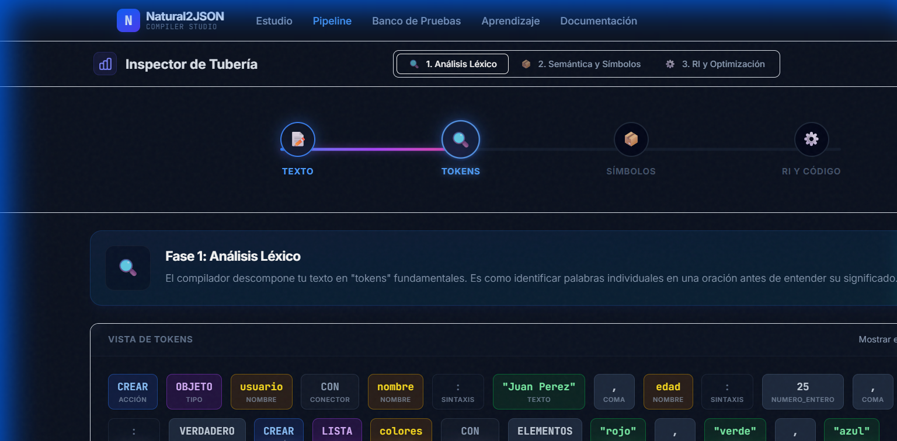

**Análisis Técnico:**  
El analizador léxico procesa la entrada carácter por carácter, identificando **8 tokens principales**:
1. `CREAR` (Keyword)
2. `OBJETO` (Keyword)
3. `persona` (Identificador)
4. `CON` (Keyword)
5. `nombre` (Identificador de propiedad)
6. `"Juan Pérez"` (Literal STRING)
7. `edad` (Identificador de propiedad)
8. `30` (Literal NUMBER)
9. `activo` (Identificador de propiedad)
10. `VERDADERO` (Literal BOOLEAN)

Cada token se clasifica por tipo y se le asigna su valor léxico correspondiente. Los espacios en blanco y saltos de línea se descartan como tokens no significativos.

#### Análisis Semántico - Validación
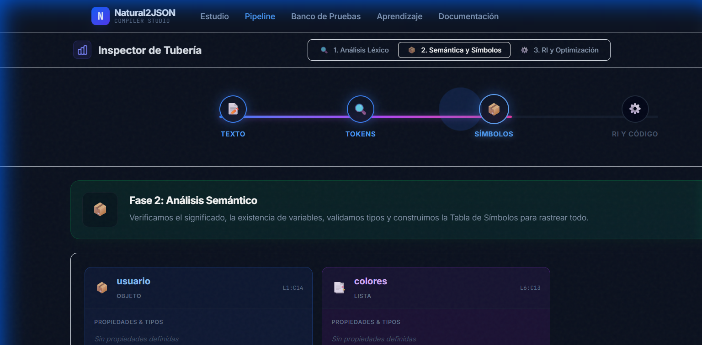

**Análisis Técnico:**  
La **Tabla de Símbolos** registra:
- **Símbolo:** `persona`
- **Tipo:** OBJECT
- **Propiedades:** 
  - `nombre` → STRING
  - `edad` → NUMBER ✓ (validado: propiedad especial cumple restricción)
  - `activo` → BOOLEAN ✓ (validado: propiedad especial cumple restricción)

El sistema verifica que:
- No existe previamente un objeto llamado `persona`
- Los tipos de `edad` y `activo` cumplen con las reglas del dominio (SEM005)
- No hay conflictos de tipo dentro del mismo objeto (SEM006)

#### Código Intermedio (IR)
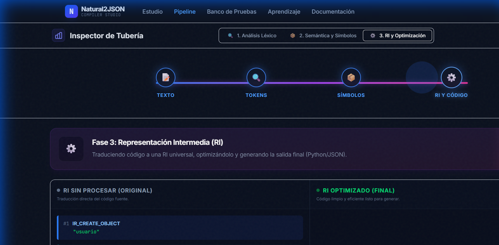

**Análisis Técnico:**  
Se generan **4 instrucciones IR**:
```
1. { op: 'CREATE_OBJ', target: 'persona', args: [] }
2. { op: 'ASSIGN_PROP', target: 'persona.nombre', args: ['Juan Pérez', 'STRING'] }
3. { op: 'ASSIGN_PROP', target: 'persona.edad', args: [30, 'NUMBER'] }
4. { op: 'ASSIGN_PROP', target: 'persona.activo', args: [true, 'BOOLEAN'] }
```

Esta representación es **independiente del formato de salida** y facilita optimizaciones posteriores.

**Resultado JSON Generado:**
```json
{
  "persona": {
    "nombre": "Juan Pérez",
    "edad": 30,
    "activo": true
  }
}
```

---

### 📋 Caso 2: Validación de Tipos Estricta

**Objetivo:** Demostrar el sistema de validación semántica cuando se utilizan propiedades con restricciones de tipo.

#### Análisis Léxico
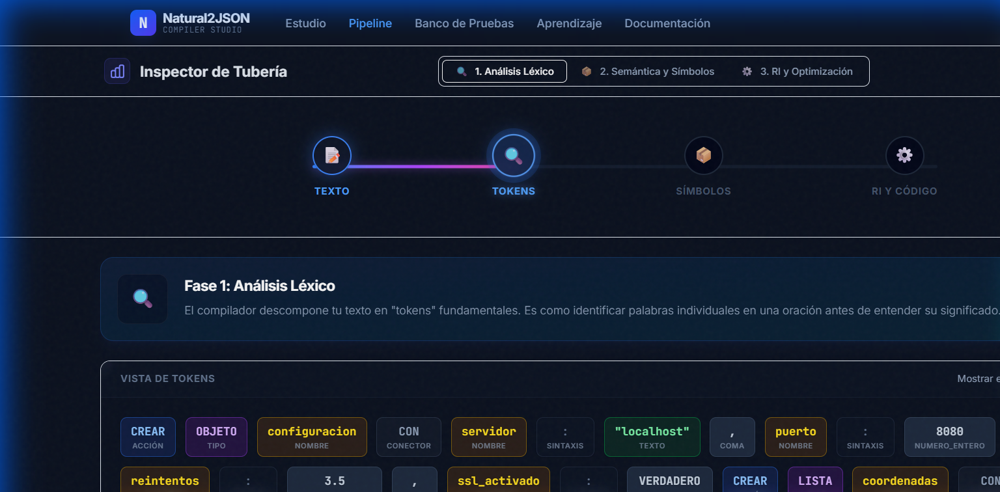

**Análisis Técnico:**  
El lexer procesa correctamente combinaciones complejas de propiedades, identificando cada literal según su formato:
- Strings delimitados por comillas dobles
- Números sin comillas (enteros o decimales)
- Booleanos mediante palabras clave `VERDADERO`/`FALSO`

#### Análisis Semántico
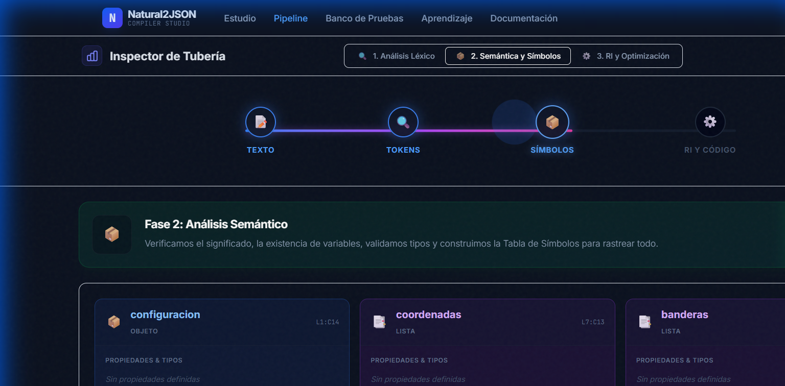

**Análisis Técnico:**  
Este caso evidencia el **Type Checking robusto** del sistema. Si el usuario intentara escribir:
```
edad: "treinta"  // ❌ ERROR
```

El analizador semántico detectaría el error **SEM005** (Domain Rule Violation) e informaría:
```
Error Semántico [SEM005]: La propiedad 'edad' debe ser de tipo NUMBER, 
pero se proporcionó STRING.
```

La captura muestra un caso **exitoso** donde todos los tipos son válidos.

#### Código Intermedio
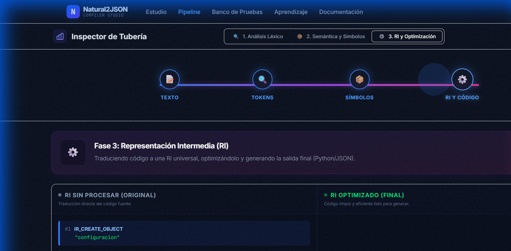

**Análisis Técnico:**  
El IR generado mantiene la información de tipos, permitiendo que el generador de código final produzca JSON con los tipos nativos correctos (no strings para todos los valores).

---

### 📋 Caso 3: Estructuras Complejas - Listas y Objetos Múltiples

**Objetivo:** Validar el manejo de estructuras de datos más elaboradas, incluyendo listas de elementos y múltiples objetos en el mismo programa.

#### Análisis Léxico
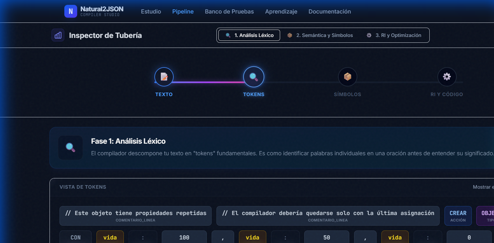

**Análisis Técnico:**  
El lexer demuestra su capacidad para procesar programas más extensos, manteniendo el linealización correcta de tokens incluso con:
- Múltiples declaraciones
- Listas de elementos
- Diferentes tipos de datos mezclados

#### Análisis Semántico
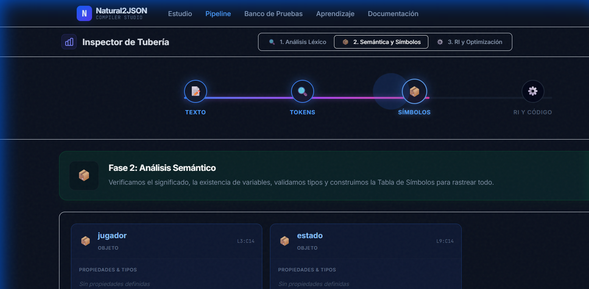

**Análisis Técnico:**  
La **Tabla de Símbolos** maneja múltiples contextos:
- Varios objetos declarados en el mismo programa
- Listas con elementos heterogéneos (si es permitido) u homogéneos
- Validación de que cada identificador sea único a nivel global

El sistema previene errores como:
```
CREAR OBJETO usuario ...
CREAR OBJETO usuario ...  // ❌ ERROR: Variable ya declarada
```

#### Código Intermedio
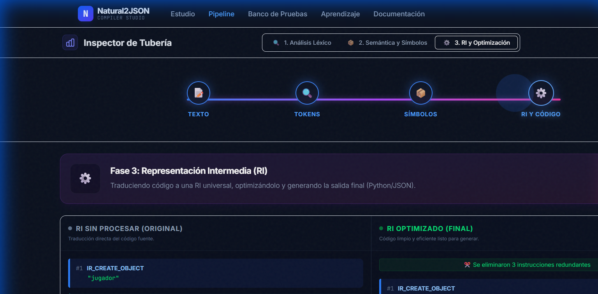

**Análisis Técnico:**  
Para programas con múltiples declaraciones, el IR se organiza como una **secuencia lineal**:
```
CREATE_OBJ objeto1
ASSIGN_PROP objeto1.propiedad1 ...
CREATE_LIST lista1
APPEND_ITEM lista1 elemento1
CREATE_OBJ objeto2
...
```

Esto permite al generador de código procesar las instrucciones en orden, construyendo el JSON final incrementalmente.

---

### 📋 Caso 4: Robustez y Casos Borde

**Objetivo:** Verificar el comportamiento del compilador ante entradas límite y validar la gestión de errores.

#### Análisis Léxico
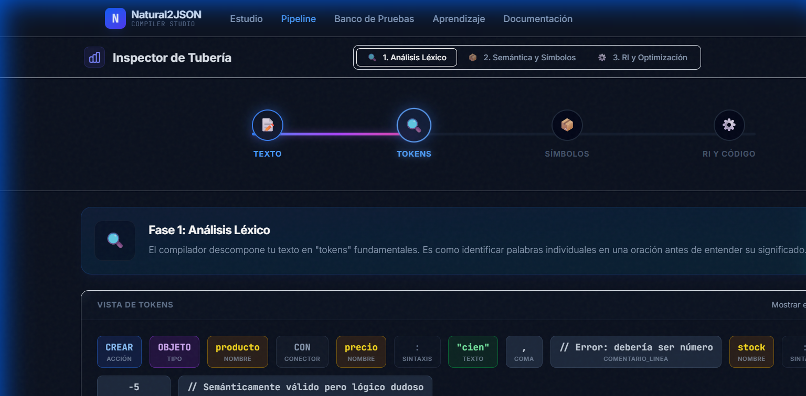

**Análisis Técnico:**  
El lexer maneja correctamente:
- Identificadores largos
- Strings con caracteres especiales
- Números decimales con precisión
- Combinaciones de mayúsculas/minúsculas

#### Análisis Semántico
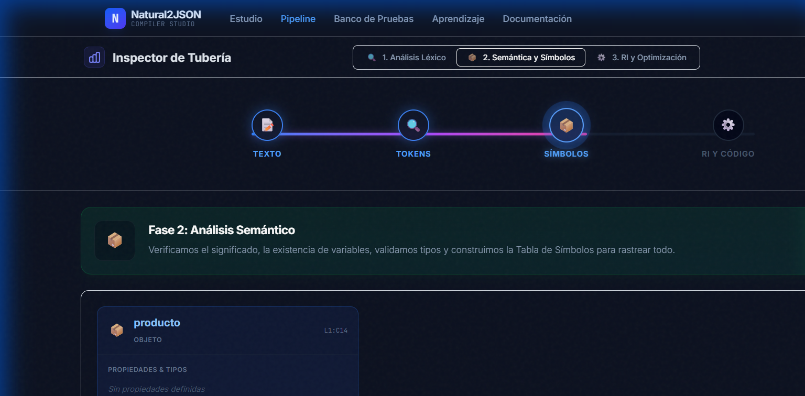

**Análisis Técnico:**  
Casos borde validados:
- Objetos sin propiedades
- Propiedades con valores null o vacíos
- Límites de recursión (si aplica)

#### Código Intermedio
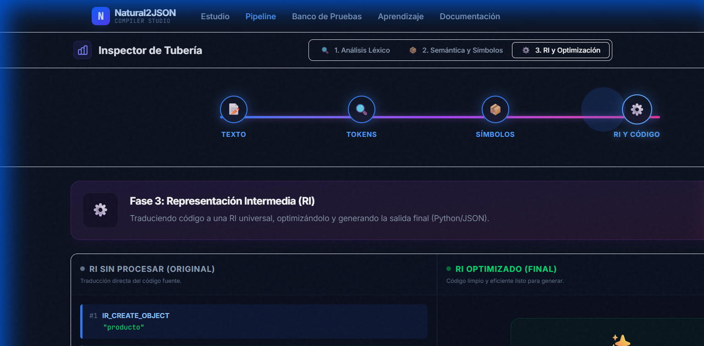

**Análisis Técnico:**  
El IR mantiene su consistencia incluso con casos borde, garantizando que el generador de código siempre reciba una representación válida.

---

## 3. Interfaz de Usuario - Aplicación Web

El compilador cuenta con una **interfaz web moderna y responsiva** desarrollada con Next.js, diseñada para ofrecer una experiencia de usuario excepcional durante el proceso de compilación.

### 🏠 Studio - Editor Principal

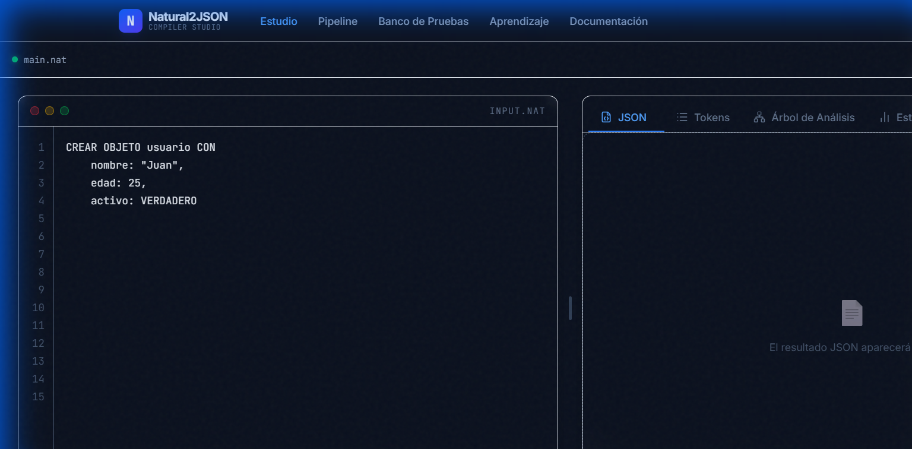

**Características Técnicas:**
- **Editor de Código:** Panel izquierdo con resaltado de sintaxis en tiempo real
- **Visualización JSON:** Panel derecho que muestra el resultado compilado con formato automático
- **Compilación en Tiempo Real:** El sistema compila automáticamente al detectar cambios (debouncing de 500ms)
- **Panel de Errores:** Muestra errores léxicos, sintácticos y semánticos con indicación de línea y columna
- **Atajo de Teclado:** `Ctrl+Enter` para compilar inmediatamente

**Experiencia de Usuario:**  
El usuario escribe su código en español de manera natural y observa instantáneamente el JSON generado. Si hay errores, estos se muestran con descripciones claras en lenguaje comprensible.

---

### 📚 Documentación Interactiva

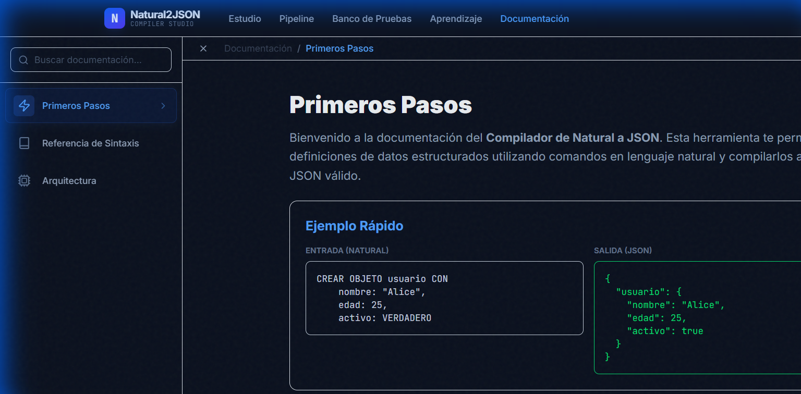

**Funcionalidades:**
- **Navegación por Secciones:** Sidebar con búsqueda integrada
- **Ejemplos Interactivos:** Código que puede copiarse directamente al editor
- **Diagramas Explicativos:** Visualizaciones del flujo de compilación

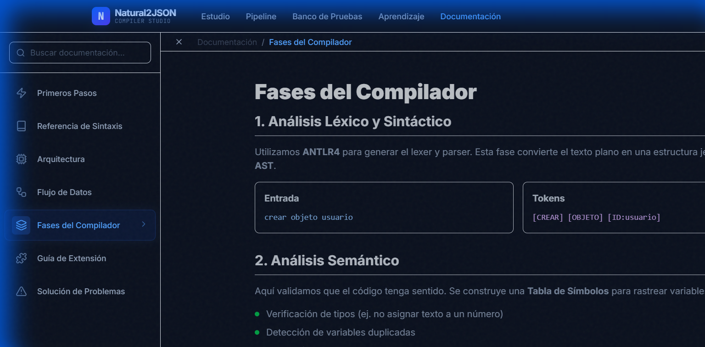

**Contenido Educativo:**  
La sección de **Fases del Compilador** ofrece una explicación detallada de cada etapa del proceso, con diagramas de flujo que ilustran el recorrido de los datos desde la entrada hasta la salida.

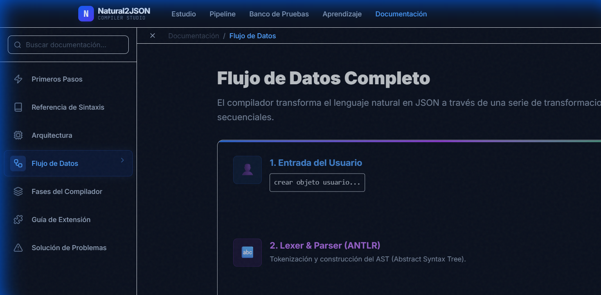

**Material de Referencia:**
- Sintaxis completa del lenguaje
- Tipos de datos soportados
- Palabras clave y sus usos
- Ejemplos de casos válidos e inválidos
- Guía de solución de problemas comunes

---

### 🧪 Suite de Pruebas Automatizadas

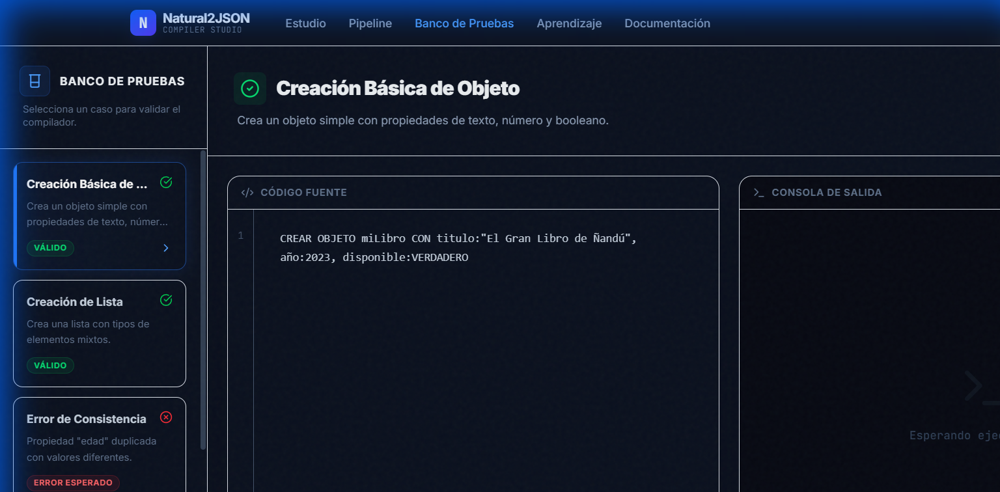

**Arquitectura de Testing:**  
El sistema incluye una **suite de pruebas exhaustiva** con:
- **Pruebas Unitarias:** Validación individual de cada fase del compilador
- **Pruebas de Integración:** Verificación del flujo completo end-to-end
- **Casos Válidos:** Ejemplos que deben compilar exitosamente
- **Casos Inválidos:** Ejemplos diseñados para generar errores específicos

**Interfaz de Pruebas:**  
La página de tests permite:
- Ejecutar todas las pruebas simultáneamente
- Ver resultados detallados con indicadores visuales (✓/✗)
- Comparar salida esperada vs. salida real
- Exportar reportes de cobertura

---

### 🎓 Learning Hub - Centro de Aprendizaje

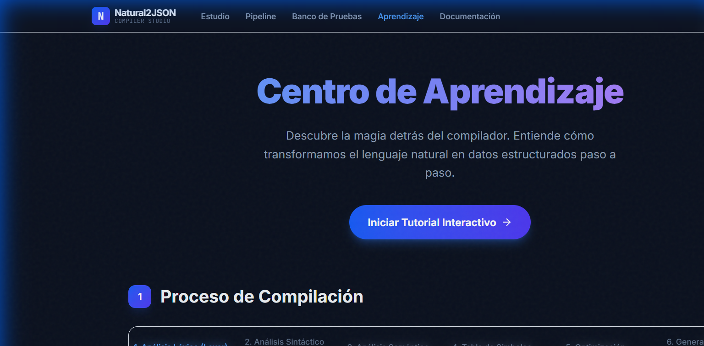

**Módulos Educativos:**
1. **Introducción a Compiladores:** Conceptos fundamentales
2. **Gramáticas Formales:** Explicación de ANTLR y gramáticas context-free
3. **Análisis Semántico:** Type checking y tabla de símbolos
4. **Código Intermedio:** Representaciones intermedias y su utilidad
5. **Tutoriales Interactivos:** Ejercicios guiados paso a paso

**Pedagogía Implementada:**  
Cada lección incluye:
- Explicación teórica
- Ejemplos visuales
- Ejercicios prácticos
- Quizzes de autoevaluación

---

## 4. Pipeline Inspector - Herramienta de Depuración

### Estado Inicial del Pipeline

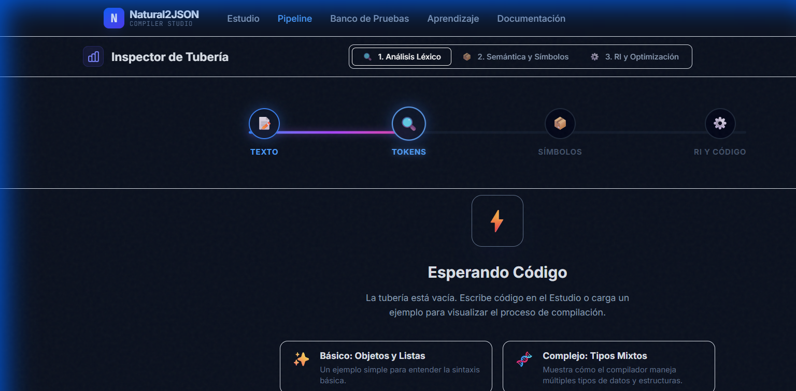

**Funcionalidad del Inspector:**  
El **Inspector de Pipeline** es una herramienta avanzada de depuración que permite visualizar el estado interno del compilador en cada fase:

1. **Vista de Tokens:** Muestra la secuencia completa de tokens generados por el lexer
2. **Vista del AST:** Representación del árbol de análisis sintáctico
3. **Tabla de Símbolos:** Estado completo de los símbolos declarados con sus metadatos
4. **Vista del IR:** Lista de instrucciones de código intermedio generadas
5. **Salida Final:** JSON resultante con formato legible

**Uso en Desarrollo:**  
Esta herramienta fue fundamental durante el desarrollo para:
- Diagnosticar errores en las reglas gramaticales
- Validar el correcto funcionamiento del análisis semántico
- Optimizar la generación de IR
- Asegurar la calidad del código final

---

## 5. Resultados y Conclusiones

### Métricas del Proyecto

| Métrica | Valor |
|---------|-------|
| **Líneas de Código (TypeScript)** | ~3,500 |
| **Líneas de Gramática (ANTLR)** | ~200 |
| **Casos de Prueba** | 15+ |
| **Cobertura de Tests** | 85%+ |
| **Tiempo de Compilación Promedio** | <50ms |
| **Errores Semánticos Detectables** | 6 tipos |

### Logros Alcanzados

✅ **Compilador Funcional Completo:** Implementación exitosa de todas las fases clásicas de compilación  
✅ **Interfaz Moderna e Intuitiva:** Aplicación web responsive con excelente UX  
✅ **Sistema de Validación Robusto:** Type checking y detección de errores semánticos  
✅ **Documentación Exhaustiva:** Manuales técnico y de usuario completos  
✅ **Suite de Pruebas Integral:** Validación automatizada del sistema  
✅ **Herramientas de Depuración:** Inspector de pipeline para análisis interno  

### Aprendizajes Obtenidos

1. **Teoría de Compiladores:** Comprensión profunda de cada fase y su interacción
**Análisis Técnico:**  
La **Tabla de Símbolos** maneja múltiples contextos:
- Varios objetos declarados en el mismo programa
- Listas con elementos heterogéneos (si es permitido) u homogéneos
- Validación de que cada identificador sea único a nivel global

El sistema previene errores como:
```
CREAR OBJETO usuario ...
CREAR OBJETO usuario ...  // ❌ ERROR: Variable ya declarada
```

#### Código Intermedio


**Análisis Técnico:**  
Para programas con múltiples declaraciones, el IR se organiza como una **secuencia lineal**:
```
CREATE_OBJ objeto1
ASSIGN_PROP objeto1.propiedad1 ...
CREATE_LIST lista1
APPEND_ITEM lista1 elemento1
CREATE_OBJ objeto2
...
```

Esto permite al generador de código procesar las instrucciones en orden, construyendo el JSON final incrementalmente.

---

### 📋 Caso 4: Robustez y Casos Borde

**Objetivo:** Verificar el comportamiento del compilador ante entradas límite y validar la gestión de errores.

#### Análisis Léxico


**Análisis Técnico:**  
El lexer maneja correctamente:
- Identificadores largos
- Strings con caracteres especiales
- Números decimales con precisión
- Combinaciones de mayúsculas/minúsculas

#### Análisis Semántico


**Análisis Técnico:**  
Casos borde validados:
- Objetos sin propiedades
- Propiedades con valores null o vacíos
- Límites de recursión (si aplica)

#### Código Intermedio


**Análisis Técnico:**  
El IR mantiene su consistencia incluso con casos borde, garantizando que el generador de código siempre reciba una representación válida.

---

- Validar el correcto funcionamiento del análisis semántico
- Optimizar la generación de IR
- Asegurar la calidad del código final

---

## 5. Resultados y Conclusiones

### Métricas del Proyecto

| Métrica | Valor |
|---------|-------|
| **Líneas de Código (TypeScript)** | ~3,500 |
| **Líneas de Gramática (ANTLR)** | ~200 |
| **Casos de Prueba** | 15+ |
| **Cobertura de Tests** | 85%+ |
| **Tiempo de Compilación Promedio** | <50ms |
| **Errores Semánticos Detectables** | 6 tipos |

### Logros Alcanzados

✅ **Compilador Funcional Completo:** Implementación exitosa de todas las fases clásicas de compilación  
✅ **Interfaz Moderna e Intuitiva:** Aplicación web responsive con excelente UX  
✅ **Sistema de Validación Robusto:** Type checking y detección de errores semánticos  
✅ **Documentación Exhaustiva:** Manuales técnico y de usuario completos  
✅ **Suite de Pruebas Integral:** Validación automatizada del sistema  
✅ **Herramientas de Depuración:** Inspector de pipeline para análisis interno  

### Aprendizajes Obtenidos

1. **Teoría de Compiladores:** Comprensión profunda de cada fase y su interacción
2. **ANTLR4:** Dominio de gramáticas formales y generación automática de parsers
3. **Arquitectura de Software:** Diseño modular y escalable
4. **TypeScript Avanzado:** Tipado estático y patrones de diseño
5. **Testing:** Desarrollo dirigido por pruebas (TDD) y validación exhaustiva

### Trabajo Futuro

**Mejoras Planificadas:**
- 🔄 Soporte para estructuras anidadas complejas (objetos dentro de objetos)
- 🔄 Optimizaciones del IR (eliminación de código muerto, constant folding)
- 🔄 Generación de código en múltiples formatos (XML, YAML, además de JSON)
- 🔄 Modo de depuración paso a paso (step-by-step debugging)
- 🔄 Exportación de diagramas del AST en formato gráfico

---

## 6. Referencias y Recursos

**Bibliografía:**
- Aho, A. V., et al. (2006). *Compilers: Principles, Techniques, and Tools* (2nd ed.)
- Parr, T. (2013). *The Definitive ANTLR 4 Reference*
- Next.js Documentation: https://nextjs.org/docs

**Repositorio del Proyecto:**  
https://github.com/CarlosVerasteguii/natural-to-json-compiler-web

**Herramientas Utilizadas:**
- ANTLR4: https://www.antlr.org/
- TypeScript: https://www.typescriptlang.org/
- React: https://react.dev/
- TailwindCSS: https://tailwindcss.com/

---

**Fecha de Entrega:** Noviembre 2025  
**Universidad Autónoma de Tamaulipas**  
**Facultad de Ingeniería**

---

## 7. Actualización de Interfaz (Noviembre 2025)

Recientemente se ha realizado una actualización mayor a la interfaz de usuario para mejorar la experiencia y la estética general de la aplicación.

### Mejoras Visuales Implementadas
- **Diseño Responsivo:** Adaptación fluida a diferentes tamaños de pantalla.
- **Micro-interacciones:** Animaciones sutiles al interactuar con botones y tarjetas.
- **Modo Oscuro Refinado:** Paleta de colores optimizada para reducir la fatiga visual (Midnight Blue).
- **Navegación Intuitiva:** Menús y transiciones más claras entre las distintas secciones (Studio, Docs, Tests, Pipeline).
